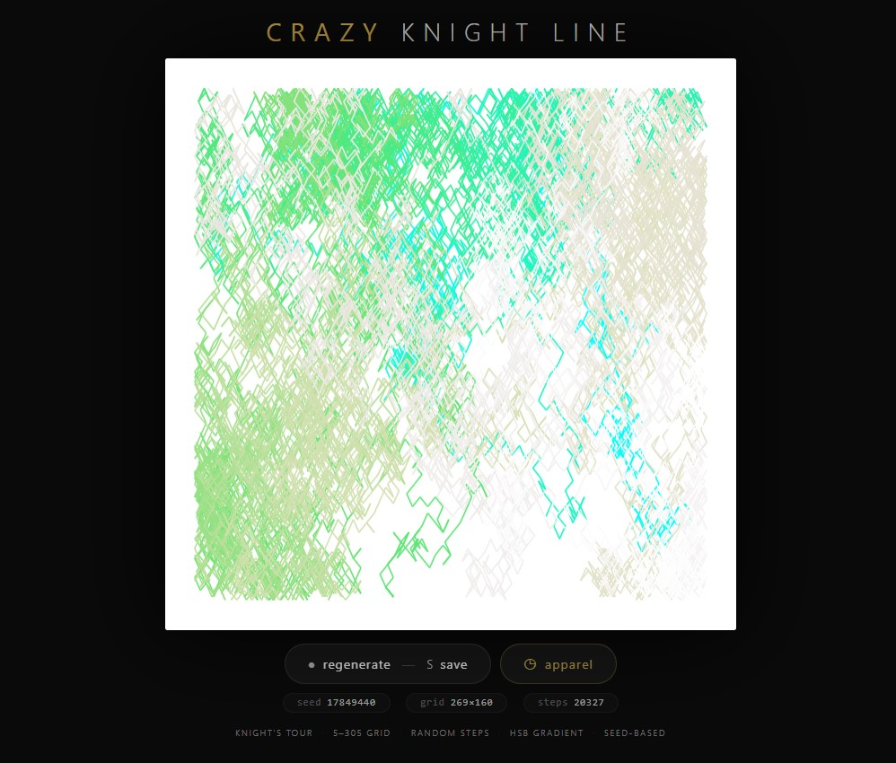
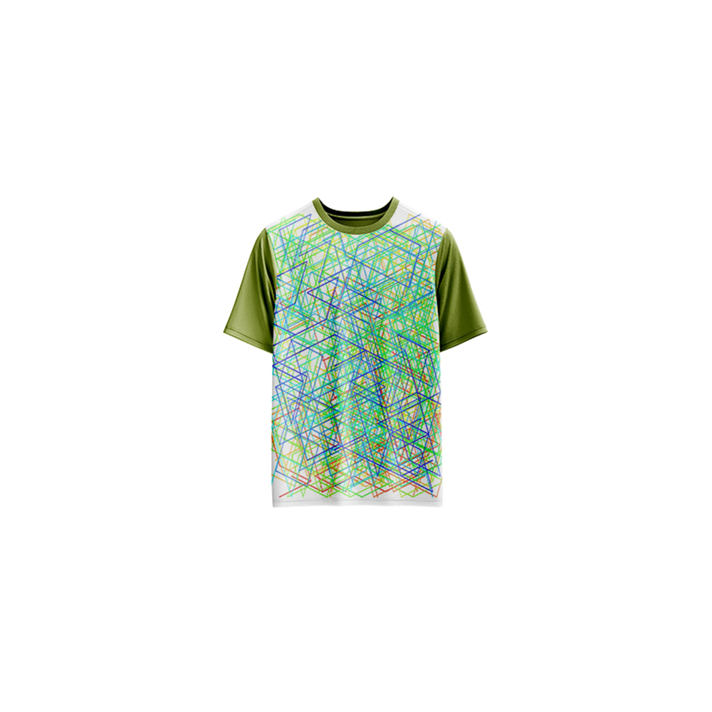

# Crazy Knight Line — Generative Art

[](https://reyrove.github.io/Crazy-Knight-Line-Generative-Art)
[](https://opensource.org/licenses/MIT)

> **Generative knight's tour art.** Each refresh creates a unique path of a knight's journey across a grid, drawing elegant lines with a beautiful HSB cyan-to-white gradient.

## 🎨 Live Demo

<div align="center">
  <a href="https://reyrove.github.io/Crazy-Knight-Line-Generative-Art" target="_blank">
    
  </a>
  <br><br>
  <a href="https://reyrove.github.io/Crazy-Knight-Line-Generative-Art" target="_blank">
    
  </a>
  <br>
  <em>Click the image or button to experience the generative art</em>
</div>

## 👕 Apparel Preview

<div align="center">
  
  <br>
  <em>Crazy Knight Line artwork printed on a T-shirt</em>
</div>

## ✨ Features

- **Knight's Tour** — Random knight moves across a grid
- **Grid-Based** — 5×5 to 305×305 grid size
- **HSB Gradient** — Beautiful cyan-to-white color transition
- **Random Path** — Unique path every refresh
- **Seed-Based** — Every composition is unique and reproducible via its seed
- **Save & Share** — Download as PNG with seed in filename
- **Apparel Mode** — Preview artwork on a T-shirt mockup
- **Responsive** — Works on desktop, tablet, and mobile
- **Pure JavaScript** — No external dependencies
- **Keyboard Shortcuts**:
  - `R` — Regenerate
  - `S` — Save image
  - `T` — Toggle apparel view

## 🎨 Artwork Details

| Parameter | Range | Description |
|-----------|-------|-------------|
| **Grid Size** | 5×5 to 305×305 | Mosaic grid dimensions |
| **Step Size 1** | 1 to grid/9 | First knight move step |
| **Step Size 2** | 0 to step1 | Second knight move step |
| **Total Steps** | 10 to grid cells | Number of moves |
| **Start Position** | Random | Starting point on grid |
| **Color Gradient** | Cyan → White | HSB smooth color transition |

## 🎯 How Knight Moves Work

A knight moves in an "L" shape:
- Two steps in one direction, then one step perpendicular
- Or one step in one direction, then two steps perpendicular

This creates beautiful, intricate path patterns across the grid.

## 🎨 Color Gradient

The artwork uses an HSB (Hue, Saturation, Brightness) color gradient:
- **Start**: Cyan (Hue=180°, Saturation=100%, Lightness=50%)
- **End**: White (Hue=0°, Saturation=0%, Lightness=100%)
- **Interpolation**: Smooth transition creating a vibrant cyan-to-white fade

## 🚀 Quick Start

### Local Development

```bash
# Clone the repository
git clone https://github.com/reyrove/Crazy-Knight-Line-Generative-Art.git

# Navigate to the directory
cd Crazy-Knight-Line-Generative-Art

# Open in browser
open index.html
# or use a live server
```

### Deploy to GitHub Pages

1. Push to GitHub
2. Go to Settings → Pages
3. Select branch `main` and root folder
4. Your site will be live at `https://reyrove.github.io/Crazy-Knight-Line-Generative-Art`

## 🧠 How It Works

The artwork is generated using a deterministic random number generator, seeded by timestamp + random noise. Every refresh:

1. **Setup**:
   - Random grid size (5-305)
   - Random step sizes (s1, s2) for knight moves
   - Random starting position
   - Random number of steps

2. **Knight's Path**:
   - Start at random position on grid
   - Each step moves in an L-shape (knight move)
   - Step sizes (s1, s2) determine the L-shape dimensions
   - Path continues until steps run out or no valid moves remain

3. **Rendering**:
   - White background
   - Each segment drawn as a line
   - Color gradient from cyan to white using HSB interpolation
   - Line width scales with canvas size

## 📁 File Structure

```
Crazy-Knight-Line-Generative-Art/
├── index.html              # Main application (all-in-one)
├── Crazy-Knight-Line.jpg   # T-shirt mockup image
├── fav.svg                 # Favicon
├── demo-screenshot.jpg     # Website demo screenshot
├── README.md               # This file
└── LICENSE                 # MIT License
```

## 🛠️ Tech Stack

- **Pure Vanilla HTML/CSS/JS** — No dependencies
- **Canvas API** — 2D rendering
- **HSL Color Model** — HSB-style gradient
- **CSS Flexbox/Grid** — Responsive layout
- **GitHub Pages** — Hosting

## 🎯 Interactive Controls

| Action | Keyboard | Button |
|--------|----------|--------|
| Regenerate | `R` | Click "regenerate" |
| Save Image | `S` | Click "regenerate" |
| Toggle Apparel | `T` | Click "apparel" |

## 🎨 The Creative Process

### Knight's Tour
The knight's tour is a classic chess problem where a knight visits every square on a board exactly once. This artwork takes inspiration from that concept, creating unique paths with random step sizes and directions.

### Step Sizes
The knight uses two step sizes (s1, s2):
- If s1=2 and s2=1, it's a standard chess knight move
- If s1=3 and s2=2, it's a larger knight-like move
- Random values create unique patterns

### HSB Color Gradient
Unlike RGB interpolation, HSB (Hue, Saturation, Brightness) interpolation creates a more vibrant and visually pleasing transition:
- The hue shifts from cyan (180°) to white
- Saturation fades from 100% to 0%
- Brightness increases from 50% to 100%

### Grid Scale
The grid size varies randomly, creating either dense, intricate patterns (large grids) or sparse, elegant designs (small grids).

## 📱 Responsive Design

The application automatically adapts to:
- Desktop screens
- Tablets
- Mobile phones
- Landscape orientation
- Various aspect ratios

## 🤝 Contributing

Contributions are welcome! Feel free to:
- Fork the repository
- Create a feature branch
- Submit a pull request

### Ideas for Contributions:
- New color palettes
- Additional movement patterns
- Animation features
- Interactive controls
- Performance optimizations

## 📄 License

MIT License — see [LICENSE](LICENSE) file for details.

## 🙏 Acknowledgments

- Inspired by the knight's tour problem
- Pure JavaScript implementation
- Special thanks to the creative coding community

---

**Built with ❤️ and crazy knight moves**